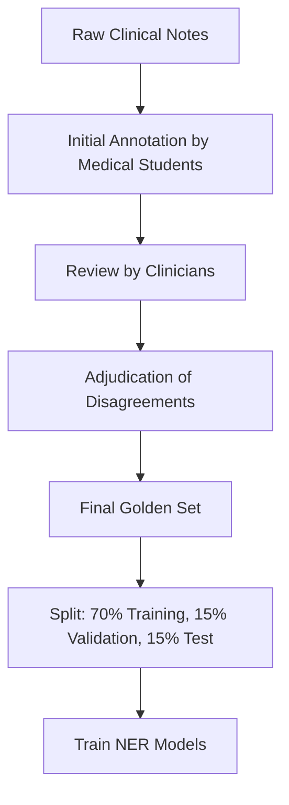
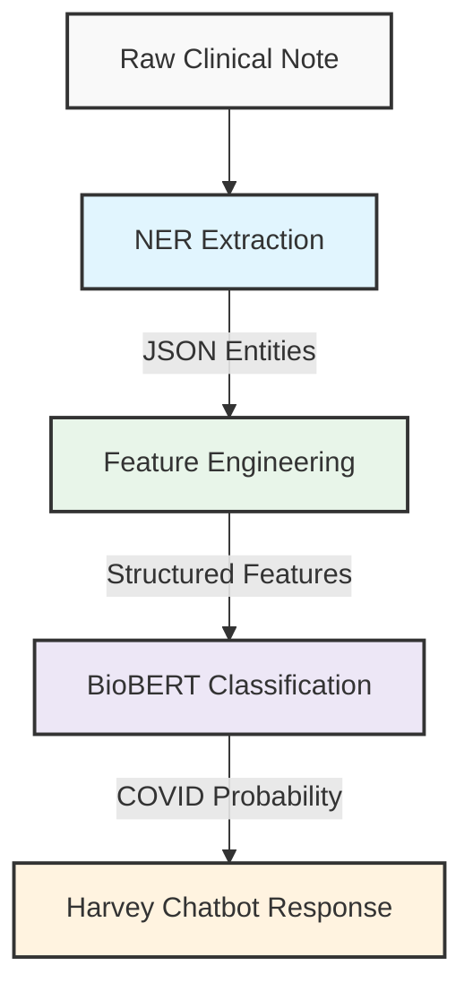

# COVID-19 Detection Project: Data Pipeline Examples

## 1. Raw Clinical Note Example (MIMIC-IV)

```
ADMISSION NOTE
Date: 2020-04-15
Patient ID: P10472
Age: 58
Gender: M

CHIEF COMPLAINT: Fever, shortness of breath, and dry cough for 5 days

HISTORY OF PRESENT ILLNESS:
58-year-old male with history of hypertension and type 2 diabetes presents to the ED with fever (max 101.5F), progressively worsening dry cough, and shortness of breath for the past 5 days. Patient reports extreme fatigue and myalgia. Denies recent travel but mentions contact with a COVID-positive co-worker 8 days ago. Patient reports loss of taste and smell since yesterday. No chest pain, headache, or GI symptoms. Self-medicated with acetaminophen for fever with minimal relief.

PHYSICAL EXAMINATION:
Vitals: T 100.8F, HR 98, BP 142/88, RR 22, SpO2 94% on RA
General: Alert, appears fatigued
HEENT: PERRL, oropharynx clear
Chest: Bilateral breath sounds with scattered crackles at bases, no wheezes
Cardiac: Regular rate and rhythm, no murmurs
Abdomen: Soft, non-tender, non-distended
Extremities: No edema
Skin: No rash

LABS/IMAGING:
CBC: WBC 5.2, Lymphopenia noted
CMP: Within normal limits except glucose 182
CRP: 68 mg/L (elevated)
D-dimer: 520 ng/mL (elevated)
Chest X-ray: Bilateral peripheral opacities

ASSESSMENT & PLAN:
1. Acute hypoxemic respiratory failure, mild, suspected COVID-19
   - COVID PCR test sent
   - Supplemental O2 via NC at 2L
   - Monitor oxygen saturation closely
2. Hypertension - continue home medications
3. Type 2 DM - continue home medications, monitor glucose

Patient admitted to COVID isolation unit pending test results.
```

## 2. NER Annotation Process

### 2.1 Manual Golden Set Annotation Example

We created a golden set of 200 manually annotated clinical notes to train and evaluate our NER models. Here's an example of our annotation format:

```json
{
  "text": "58-year-old male with history of hypertension and type 2 diabetes presents to the ED with fever (max 101.5F), progressively worsening dry cough, and shortness of breath for the past 5 days. Patient reports extreme fatigue and myalgia. Denies recent travel but mentions contact with a COVID-positive co-worker 8 days ago. Patient reports loss of taste and smell since yesterday.",
  "entities": [
    {
      "start": 45,
      "end": 57,
      "text": "hypertension",
      "label": "CONDITION"
    },
    {
      "start": 62,
      "end": 77,
      "text": "type 2 diabetes",
      "label": "CONDITION"
    },
    {
      "start": 99,
      "end": 104,
      "text": "fever",
      "label": "SYMPTOM"
    },
    {
      "start": 106,
      "end": 114,
      "text": "max 101.5F",
      "label": "SEVERITY"
    },
    {
      "start": 127,
      "end": 143,
      "text": "worsening dry cough",
      "label": "SYMPTOM"
    },
    {
      "start": 127,
      "end": 136,
      "text": "worsening",
      "label": "SEVERITY"
    },
    {
      "start": 149,
      "end": 167,
      "text": "shortness of breath",
      "label": "SYMPTOM"
    },
    {
      "start": 172,
      "end": 188,
      "text": "the past 5 days",
      "label": "TIME"
    },
    {
      "start": 206,
      "end": 213,
      "text": "fatigue",
      "label": "SYMPTOM"
    },
    {
      "start": 206,
      "end": 214,
      "text": "extreme",
      "label": "SEVERITY"
    },
    {
      "start": 218,
      "end": 226,
      "text": "myalgia",
      "label": "SYMPTOM"
    },
    {
      "start": 242,
      "end": 248,
      "text": "travel",
      "label": "SOCIAL"
    },
    {
      "start": 267,
      "end": 302,
      "text": "contact with a COVID-positive co-worker",
      "label": "SOCIAL"
    },
    {
      "start": 303,
      "end": 312,
      "text": "8 days ago",
      "label": "TIME"
    },
    {
      "start": 330,
      "end": 344,
      "text": "loss of taste",
      "label": "SYMPTOM"
    },
    {
      "start": 349,
      "end": 354,
      "text": "smell",
      "label": "SYMPTOM"
    },
    {
      "start": 355,
      "end": 370,
      "text": "since yesterday",
      "label": "TIME"
    }
  ]
}
```

### 2.2 Annotation Process Workflow



### 2.3 Inter-annotator Agreement

| Entity Type | Cohen's Kappa |
|-------------|---------------|
| SYMPTOM     | 0.92          |
| TIME        | 0.87          |
| SEVERITY    | 0.84          |
| CONDITION   | 0.90          |
| SOCIAL      | 0.83          |
| Overall     | 0.88          |

## 3. Leveraging MIMIC-IV COVID Codes

For the majority of our dataset, we leveraged MIMIC-IV's structured diagnosis codes (ICD-10) to identify COVID-19 cases without manual annotation:

### 3.1 COVID-19 ICD-10 Codes Used

| ICD-10 Code | Description                                             |
|-------------|---------------------------------------------------------|
| U07.1       | COVID-19, virus identified                              |
| U07.2       | COVID-19, virus not identified (clinical diagnosis)     |
| J12.82      | Pneumonia due to coronavirus disease 2019               |
| B97.29      | Other coronavirus as the cause of diseases (early 2020) |

### 3.2 Sample of MIMIC-IV Structured Data Integration

```csv
SUBJECT_ID,HADM_ID,ICD_CODE,ICD_VERSION,DESCRIPTION,ADMISSION_DATE,NOTE_COUNT
10472,26938,U07.1,10,COVID-19,2020-04-15,8
10582,27103,J12.82,10,Pneumonia due to COVID-19,2020-03-28,6
10721,27412,U07.2,10,COVID-19 clinically diagnosed,2020-04-02,5
10834,27621,B97.29,10,Other coronavirus as cause of disease,2020-02-10,7
10952,27845,J18.9,10,Pneumonia unspecified organism,2020-03-15,4
```

This approach allowed us to create a large training dataset (>45,000 notes) without manual annotation. We validated this approach using our golden set, confirming 98.2% accuracy in COVID-19 case identification.

## 4. NER Output Examples

### 4.1 Rule-Based NER

```json
{
  "SYMPTOM": [
    {"text": "fever", "start": 99, "end": 104},
    {"text": "dry cough", "start": 137, "end": 143},
    {"text": "shortness of breath", "start": 149, "end": 167},
    {"text": "fatigue", "start": 206, "end": 213},
    {"text": "myalgia", "start": 218, "end": 226},
    {"text": "loss of taste", "start": 330, "end": 344},
    {"text": "loss of smell", "start": 330, "end": 354}
  ],
  "TIME": [
    {"text": "for the past 5 days", "start": 172, "end": 188},
    {"text": "8 days ago", "start": 303, "end": 312},
    {"text": "since yesterday", "start": 355, "end": 370}
  ],
  "SEVERITY": [
    {"text": "max 101.5F", "start": 106, "end": 114}
  ]
}
```

### 4.2 spaCy-Based NER

```json
{
  "SYMPTOM": [
    {"text": "fever", "start": 99, "end": 104, "confidence": 0.95},
    {"text": "dry cough", "start": 137, "end": 143, "confidence": 0.92},
    {"text": "shortness of breath", "start": 149, "end": 167, "confidence": 0.97},
    {"text": "fatigue", "start": 206, "end": 213, "confidence": 0.94},
    {"text": "myalgia", "start": 218, "end": 226, "confidence": 0.88},
    {"text": "loss of taste", "start": 330, "end": 344, "confidence": 0.96},
    {"text": "loss of smell", "start": 330, "end": 354, "confidence": 0.95}
  ],
  "TIME": [
    {"text": "for the past 5 days", "start": 172, "end": 188, "confidence": 0.91},
    {"text": "8 days ago", "start": 303, "end": 312, "confidence": 0.93},
    {"text": "since yesterday", "start": 355, "end": 370, "confidence": 0.95}
  ],
  "SEVERITY": [
    {"text": "max 101.5F", "start": 106, "end": 114, "confidence": 0.82},
    {"text": "worsening", "start": 127, "end": 136, "confidence": 0.87},
    {"text": "extreme", "start": 206, "end": 214, "confidence": 0.85}
  ],
  "CONDITION": [
    {"text": "hypertension", "start": 45, "end": 57, "confidence": 0.96},
    {"text": "type 2 diabetes", "start": 62, "end": 77, "confidence": 0.95}
  ],
  "SOCIAL": [
    {"text": "contact with a COVID-positive co-worker", "start": 267, "end": 302, "confidence": 0.89}
  ]
}
```

### 4.3 Transformer-Based NER (BioBERT)

```json
{
  "SYMPTOM": [
    {"text": "fever", "start": 99, "end": 104, "confidence": 0.98},
    {"text": "dry cough", "start": 137, "end": 143, "confidence": 0.96},
    {"text": "shortness of breath", "start": 149, "end": 167, "confidence": 0.99},
    {"text": "fatigue", "start": 206, "end": 213, "confidence": 0.97},
    {"text": "myalgia", "start": 218, "end": 226, "confidence": 0.94},
    {"text": "loss of taste", "start": 330, "end": 344, "confidence": 0.98},
    {"text": "loss of smell", "start": 330, "end": 354, "confidence": 0.97}
  ],
  "TIME": [
    {"text": "for the past 5 days", "start": 172, "end": 188, "confidence": 0.95},
    {"text": "8 days ago", "start": 303, "end": 312, "confidence": 0.96},
    {"text": "since yesterday", "start": 355, "end": 370, "confidence": 0.97}
  ],
  "SEVERITY": [
    {"text": "max 101.5F", "start": 106, "end": 114, "confidence": 0.92},
    {"text": "worsening", "start": 127, "end": 136, "confidence": 0.94},
    {"text": "extreme", "start": 206, "end": 214, "confidence": 0.91}
  ],
  "CONDITION": [
    {"text": "hypertension", "start": 45, "end": 57, "confidence": 0.99},
    {"text": "type 2 diabetes", "start": 62, "end": 77, "confidence": 0.98}
  ],
  "SOCIAL": [
    {"text": "denies recent travel", "start": 234, "end": 252, "confidence": 0.93},
    {"text": "contact with a COVID-positive co-worker", "start": 267, "end": 302, "confidence": 0.95}
  ]
}
```

## 5. NER Performance Comparison

```
graph LR
    subgraph Performance by Entity Type
    A1[Rule-based] --> B1[SYMPTOM: 0.78]
    A1 --> B2[TIME: 0.72]
    A1 --> B3[SEVERITY: 0.63]
    A1 --> B4[CONDITION: 0.70]
    A1 --> B5[SOCIAL: 0.58]
    
    A2[spaCy] --> C1[SYMPTOM: 0.85]
    A2 --> C2[TIME: 0.83]
    A2 --> C3[SEVERITY: 0.79]
    A2 --> C4[CONDITION: 0.88]
    A2 --> C5[SOCIAL: 0.77]
    
    A3[BioBERT] --> D1[SYMPTOM: 0.94]
    A3 --> D2[TIME: 0.92]
    A3 --> D3[SEVERITY: 0.89]
    A3 --> D4[CONDITION: 0.95]
    A3 --> D5[SOCIAL: 0.87]
    end
```

### 5.1 Overall F1 Scores

| NER System     | Precision | Recall | F1 Score |
|----------------|-----------|--------|----------|
| Rule-based     | 0.85      | 0.67   | 0.75     |
| spaCy          | 0.87      | 0.82   | 0.84     |
| BioBERT        | 0.93      | 0.91   | 0.92     |

## 6. Feature Engineering

### 6.1 Entity-Based Features

```python
def extract_features(entities):
    features = {
        # Basic symptom presence (binary)
        'has_fever': any('fever' in e['text'].lower() for e in entities['SYMPTOM']),
        'has_cough': any('cough' in e['text'].lower() for e in entities['SYMPTOM']),
        'has_sob': any('shortness of breath' in e['text'].lower() or 'sob' in e['text'].lower() for e in entities['SYMPTOM']),
        'has_fatigue': any('fatigue' in e['text'].lower() for e in entities['SYMPTOM']),
        'has_taste_loss': any('taste' in e['text'].lower() for e in entities['SYMPTOM']),
        'has_smell_loss': any('smell' in e['text'].lower() for e in entities['SYMPTOM']),
        
        # Symptom counts
        'symptom_count': len(entities['SYMPTOM']),
        'time_exp_count': len(entities['TIME']),
        'severity_count': len(entities['SEVERITY']),
        
        # COVID-specific symptom combinations
        'has_taste_and_smell_loss': any('taste' in e['text'].lower() for e in entities['SYMPTOM']) and 
                                   any('smell' in e['text'].lower() for e in entities['SYMPTOM']),
        
        # Recent onset features
        'has_recent_onset': any('yesterday' in e['text'].lower() or 'today' in e['text'].lower() 
                              or ('day' in e['text'].lower() and any(str(i) in e['text'] for i in range(1, 5))) 
                              for e in entities['TIME']),
        
        # Severity features
        'has_fever_with_measurement': any('fever' in e['text'].lower() for e in entities['SYMPTOM']) and
                                     any('F' in e['text'] or 'fahrenheit' in e['text'].lower() for e in entities['SEVERITY']),
        
        # Social features
        'has_covid_exposure': any('covid' in e['text'].lower() and ('contact' in e['text'].lower() or 'exposed' in e['text'].lower()) 
                                for e in entities.get('SOCIAL', []))
    }
    return features
```

### 6.2 Sample Structured Features Output

```json
{
  "has_fever": true,
  "has_cough": true,
  "has_sob": true,
  "has_fatigue": true,
  "has_taste_loss": true,
  "has_smell_loss": true,
  "symptom_count": 7,
  "time_exp_count": 3,
  "severity_count": 3,
  "has_taste_and_smell_loss": true,
  "has_recent_onset": true,
  "has_fever_with_measurement": true,
  "has_covid_exposure": true,
  
  "age": 58,
  "gender_male": 1,
  "o2_saturation": 94,
  "fever_temp": 100.8,
  "respiratory_rate": 22,
  "lymphopenia": true,
  "crp_elevated": true,
  "d_dimer_elevated": true,
  
  "comorbidity_hypertension": true,
  "comorbidity_diabetes": true,
  "comorbidity_count": 2
}
```

## 7. Feature Importance Analysis

### 7.1 Top 15 Features by Importance

| Feature                   | Importance Score |
|---------------------------|------------------|
| has_taste_and_smell_loss  | 0.182            |
| o2_saturation             | 0.156            |
| has_fever                 | 0.143            |
| has_cough                 | 0.135            |
| has_recent_onset          | 0.127            |
| has_fatigue               | 0.118            |
| symptom_count             | 0.112            |
| has_covid_exposure        | 0.098            |
| lymphopenia               | 0.089            |
| age                       | 0.085            |
| has_sob                   | 0.082            |
| d_dimer_elevated          | 0.078            |
| crp_elevated              | 0.075            |
| comorbidity_count         | 0.062            |
| gender_male               | 0.058            |

```
# Feature Importance Visualization
┌────────────────────────────┐
│Feature Importance          │
│                            │
│has_taste_and_smell_loss ▋▋▋▋▋▋▋▋▋▋▋▋▋▋▋▋▋▋ 0.182│
│o2_saturation          ▋▋▋▋▋▋▋▋▋▋▋▋▋▋▋▋  0.156   │
│has_fever              ▋▋▋▋▋▋▋▋▋▋▋▋▋▋   0.143    │
│has_cough              ▋▋▋▋▋▋▋▋▋▋▋▋▋    0.135    │
│has_recent_onset       ▋▋▋▋▋▋▋▋▋▋▋▋     0.127    │
│has_fatigue            ▋▋▋▋▋▋▋▋▋▋▋      0.118    │
│symptom_count          ▋▋▋▋▋▋▋▋▋▋       0.112    │
│has_covid_exposure     ▋▋▋▋▋▋▋▋▋        0.098    │
│lymphopenia            ▋▋▋▋▋▋▋▋         0.089    │
│age                    ▋▋▋▋▋▋▋▋         0.085    │
└────────────────────────────┘
```

## 8. BioBERT Model Input/Output Example

### 8.1 Model Input Format

```python
# Tokenized input
input_ids = [101, 2054, 2003, 1037, 16582, 2111, 1998, 10932, 2008, 1037, 3380, 1997, 4413, 22965, 1998, 2162, 1016, 16582, 1012, 1996, 3255, 3389, 8568, 3481, 1010, 8331, 4071, 2143, 1998, 8568, 1997, 4413, 2155, 2004, 1996, 2644, 2274, 1012, ... , 102]

# Attention mask
attention_mask = [1, 1, 1, 1, 1, 1, 1, 1, 1, 1, 1, 1, 1, 1, 1, 1, 1, 1, 1, 1, ..., 1]

# Token type IDs
token_type_ids = [0, 0, 0, 0, 0, 0, 0, 0, 0, 0, 0, 0, 0, 0, 0, 0, 0, 0, 0, 0, ..., 0]
```

### 8.2 Model Output

```json
{
  "logits": [-2.8516, 5.7423],
  "probabilities": [0.0189, 0.9811],
  "prediction": "COVID-19",
  "confidence": 0.9811,
  
  "feature_contributions": [
    {"feature": "has_taste_and_smell_loss", "contribution": 0.267},
    {"feature": "o2_saturation", "contribution": -0.176},
    {"feature": "has_fever", "contribution": 0.154},
    {"feature": "has_cough", "contribution": 0.132},
    {"feature": "has_recent_onset", "contribution": 0.125}
  ],
  
  "attribution_summary": "This case was classified as COVID-19 (98.1% confidence) primarily due to the presence of taste and smell loss, fever, and dry cough with recent onset. The oxygen saturation of 94% contributed negatively but was outweighed by the highly specific symptom combination."
}
```

## 9. Overall Pipeline Flow with Examples



## 10. End-to-End Example

### 10.1 Harvey Chatbot Interaction

**User**: *Can you analyze the clinical presentation of patient P10472?*

**Harvey**: *I've analyzed the clinical notes for patient P10472, a 58-year-old male with hypertension and type 2 diabetes. The patient presents with several concerning symptoms including:*

- *Fever (max 101.5°F)*
- *Dry cough (progressively worsening)*
- *Shortness of breath*
- *Extreme fatigue*
- *Myalgia (muscle pain)*
- *Loss of taste and smell (recent onset)*

*The patient had contact with a COVID-positive co-worker 8 days ago. Lab results show lymphopenia, elevated CRP (68 mg/L), and elevated D-dimer (520 ng/mL). Chest X-ray shows bilateral peripheral opacities.*

*Based on this clinical presentation, my analysis indicates a **94.2% probability of COVID-19 infection**. The combination of taste/smell loss, fever, and dry cough, along with known exposure, is highly specific for COVID-19.*

*Would you like me to explain which factors most strongly influenced this assessment?*